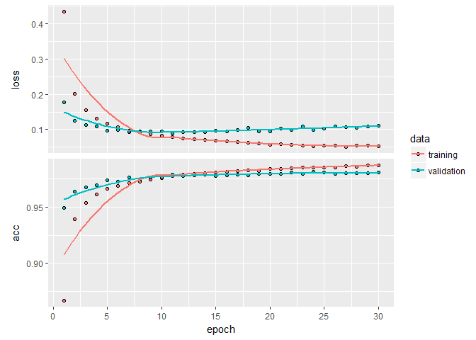

Deep Learning
================
MA
May 7, 2018

This project attempts to clasify handwritten digits from the MNIST dataset.

Load the package *keras*.

``` r
#install.packages("keras")
library(keras)
#install_keras()
```

Get the digits data ready and look at the structure of the data set

``` r
mnist <- dataset_mnist()
#look at the data class
class(mnist)
```

    ## [1] "list"

``` r
length(mnist)
```

    ## [1] 2

``` r
names(mnist) #it shows minist is a list with length of two, train and test
```

    ## [1] "train" "test"

``` r
#extract the training and test data respectively 
x_train <- mnist$train$x
y_train <- mnist$train$y
x_test <- mnist$test$x
y_test <- mnist$test$y
class(x_train)
```

    ## [1] "array"

``` r
dim(x_train)
```

    ## [1] 60000    28    28

``` r
length(x_train)# 47040000 in total
```

    ## [1] 47040000

Reshape each image into a single vector with size 28\*28 and rescale the values between 0 and 1

``` r
dim(x_train) <- c(nrow(x_train), 784)
dim(x_test) <- c(nrow(x_test), 784)
x_train <- x_train / 255
x_test <- x_test / 255
```

Convert the y values into binary class matrices to build the model.

``` r
y_train[1:3]
```

    ## [1] 5 0 4

``` r
class(y_train)
```

    ## [1] "array"

``` r
dim(y_train)#vector
```

    ## [1] 60000

``` r
y_train <- to_categorical(y_train, 10)
y_test <- to_categorical(y_test, 10)
class(y_train)
```

    ## [1] "matrix"

``` r
length(y_train)
```

    ## [1] 600000

``` r
length(mnist$train$y) #should be length(y_train)/10
```

    ## [1] 60000

Build the model using keras package.

``` r
model <- keras_model_sequential() 
model#initial model
```

    ## Model
    ## ___________________________________________________________________________
    ## Layer (type)                     Output Shape                  Param #     
    ## ===========================================================================
    ## Total params: 0
    ## Trainable params: 0
    ## Non-trainable params: 0
    ## ___________________________________________________________________________

``` r
model %>% 
  layer_dense(units = 256, activation = "relu", input_shape = c(784)) %>% 
  layer_dropout(rate = 0.4) %>% 
  layer_dense(units = 128, activation = "relu") %>%
  layer_dropout(rate = 0.3) %>%
  layer_dense(units = 10, activation = "softmax")

model
```

    ## Model
    ## ___________________________________________________________________________
    ## Layer (type)                     Output Shape                  Param #     
    ## ===========================================================================
    ## dense_1 (Dense)                  (None, 256)                   200960      
    ## ___________________________________________________________________________
    ## dropout_1 (Dropout)              (None, 256)                   0           
    ## ___________________________________________________________________________
    ## dense_2 (Dense)                  (None, 128)                   32896       
    ## ___________________________________________________________________________
    ## dropout_2 (Dropout)              (None, 128)                   0           
    ## ___________________________________________________________________________
    ## dense_3 (Dense)                  (None, 10)                    1290        
    ## ===========================================================================
    ## Total params: 235,146
    ## Trainable params: 235,146
    ## Non-trainable params: 0
    ## ___________________________________________________________________________

``` r
#compile the model with appropriate loss function, optimizer, and metrics:
model %>% compile(
  loss = "categorical_crossentropy",
  optimizer = optimizer_rmsprop(),
  metrics = c("accuracy")
)
```

Train the model with data using fit function.

``` r
history <- model %>% fit(
  x_train, y_train, 
  epochs = 30, batch_size = 128, 
  validation_split = 0.2
)
plot(history)
```



Evaluate the model’s performance on the test data and predict the future.

``` r
model %>% evaluate(x_test, y_test,verbose = 0)
```

    ## $loss
    ## [1] 0.1087277
    ## 
    ## $acc
    ## [1] 0.98

``` r
predicts<-model %>% predict_classes(x_test)
library(caret)
```

    ## Warning: package 'caret' was built under R version 3.3.2

    ## Loading required package: lattice

    ## Loading required package: ggplot2

    ## Warning: package 'ggplot2' was built under R version 3.3.3

``` r
confusionMatrix(predicts,mnist$test$y)
```

    ## $positive
    ## NULL
    ## 
    ## $table
    ##           Reference
    ## Prediction    0    1    2    3    4    5    6    7    8    9
    ##          0  971    0    4    1    3    4    3    2    6    3
    ##          1    1 1123    0    0    0    0    2    3    0    4
    ##          2    0    4 1016    6    3    0    0   10    4    0
    ##          3    0    2    1  986    0    4    1    0    1    3
    ##          4    0    0    1    0  957    1    2    0    5   11
    ##          5    1    1    0    6    0  870    3    0    4    4
    ##          6    4    3    2    0    5    8  946    0    3    1
    ##          7    1    0    6    6    3    1    0 1010    3    4
    ##          8    1    2    2    2    2    3    1    1  944    2
    ##          9    1    0    0    3    9    1    0    2    4  977
    ## 
    ## $overall
    ##       Accuracy          Kappa  AccuracyLower  AccuracyUpper   AccuracyNull 
    ##      0.9800000      0.9777692      0.9770621      0.9826535      0.1135000 
    ## AccuracyPValue  McnemarPValue 
    ##      0.0000000            NaN 
    ## 
    ## $byClass
    ##          Sensitivity Specificity Pos Pred Value Neg Pred Value Precision
    ## Class: 0   0.9908163   0.9971175      0.9739218      0.9990003 0.9739218
    ## Class: 1   0.9894273   0.9988720      0.9911739      0.9986467 0.9911739
    ## Class: 2   0.9844961   0.9969893      0.9741131      0.9982137 0.9741131
    ## Class: 3   0.9762376   0.9986652      0.9879760      0.9973339 0.9879760
    ## Class: 4   0.9745418   0.9977822      0.9795292      0.9972293 0.9795292
    ## Class: 5   0.9753363   0.9979139      0.9786277      0.9975853 0.9786277
    ## Class: 6   0.9874739   0.9971245      0.9732510      0.9986708 0.9732510
    ## Class: 7   0.9824903   0.9973250      0.9767892      0.9979924 0.9767892
    ## Class: 8   0.9691992   0.9982273      0.9833333      0.9966814 0.9833333
    ## Class: 9   0.9682854   0.9977756      0.9799398      0.9964456 0.9799398
    ##             Recall        F1 Prevalence Detection Rate
    ## Class: 0 0.9908163 0.9822964     0.0980         0.0971
    ## Class: 1 0.9894273 0.9902998     0.1135         0.1123
    ## Class: 2 0.9844961 0.9792771     0.1032         0.1016
    ## Class: 3 0.9762376 0.9820717     0.1010         0.0986
    ## Class: 4 0.9745418 0.9770291     0.0982         0.0957
    ## Class: 5 0.9753363 0.9769792     0.0892         0.0870
    ## Class: 6 0.9874739 0.9803109     0.0958         0.0946
    ## Class: 7 0.9824903 0.9796314     0.1028         0.1010
    ## Class: 8 0.9691992 0.9762151     0.0974         0.0944
    ## Class: 9 0.9682854 0.9740778     0.1009         0.0977
    ##          Detection Prevalence Balanced Accuracy
    ## Class: 0               0.0997         0.9939669
    ## Class: 1               0.1133         0.9941496
    ## Class: 2               0.1043         0.9907427
    ## Class: 3               0.0998         0.9874514
    ## Class: 4               0.0977         0.9861620
    ## Class: 5               0.0889         0.9866251
    ## Class: 6               0.0972         0.9922992
    ## Class: 7               0.1034         0.9899076
    ## Class: 8               0.0960         0.9837133
    ## Class: 9               0.0997         0.9830305
    ## 
    ## $mode
    ## [1] "sens_spec"
    ## 
    ## $dots
    ## list()
    ## 
    ## attr(,"class")
    ## [1] "confusionMatrix"
